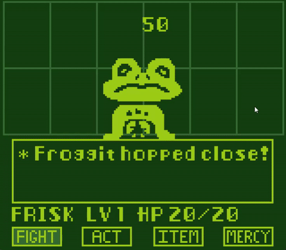

# UNDERTALE Pocket Battle
A Game Boy styled demake of UNDERTALE's battle system in raylib!

## INSTRUCTIONS:
1. Download the release binary from the "Releases" page on this repository
2. Extract the binary into its own folder
3. Run the .exe file

## SOFTWARE USED:
- Code: [Visual Studio Code](https://github.com/microsoft/vscode) by [Microsoft](https://github.com/microsoft) (build tasks taken from [raylib-VSCode-Template](https://github.com/AndrewHamel111/raylib-VSCode-Template))
- Music: [Trackerboy](https://github.com/stoneface86/trackerboy) by [stoneface86](https://github.com/stoneface86) (pretty decent tracker for the Game Boy soundchip, albeit somewhat limited)
- Art: [LibreSprite](https://github.com/LibreSprite/LibreSprite) by [LibreSprite Dev Team](https://github.com/LibreSprite) (I will admit that I did take a Froggit sprite and downscaled it as a base for its animations, but the animation and the rest of the art was done by eyeballing the original HUD)
